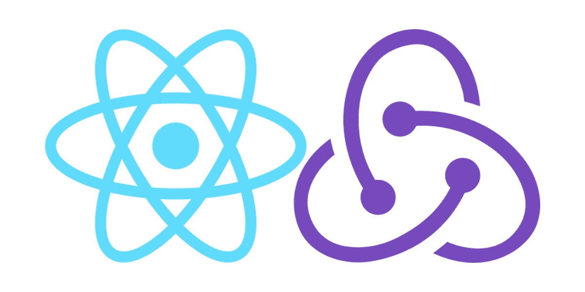

ToDo приложение на React + Redux. 

Реализован функционал добавления , удаление и отметка выполнения задач, а также их фильтрация. 

Также реализовано добавления информации на localstorage.

Ссылка на проект: https://webdevmurad.github.io/todo

##############################################

Данный проект можно склонировать к себе на компьютер через терминал введя команду : https://github.com/webdevmurad/todo.git

Потом введите команду: npm i или npm install, разницы нет. (Для установления зависимостей.)

И последнюю команду которую вы должны ввести : npm start , для того чтобы проект запустился.

##############################################

[Demo Spa приложения можно посмотреть здесь ](https://webdevmurad.github.io/todo/)
